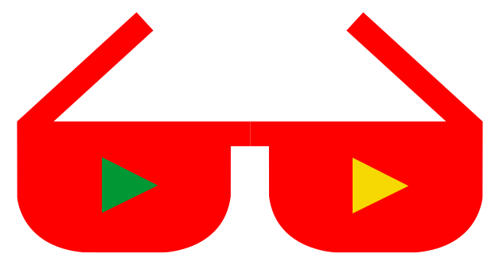

<!--lint disable double-link-->
<!--lint disable awesome-heading-->

  	<h1>
    	Awesome Brazilian YouTubers
		
  	</h1>
	 
	

		
	

> Assista tutoriais de YouTubers que ensinam sobre tecnologia.

## Índice

Para encontrar um tópico específico mais rápido, você pode pressionar `Ctrl + F` e digitar o tópico que está procurando.

- [Programação em Geral](#programação-em-geral)
- [Desenvolvimento Web](#desenvolvimento-web)
  - [Frontend](#frontend)
  - [Backend](#backend)
- [Ciência da Computação](#ciência-da-computação)
- [Machine learning](#machine-learning)
- [DevOps](#devops)
- [Desenvolvimento de Jogos](#desenvolvimento-de-jogos)
- [Desenvolvimento Móvel](#desenvolvimento-móvel)
- [Desenvolvimento Embarcado](#desenvolvimento-embarcado)
- [Cyber-segurança](#cyber-segurança)
- [Internet/redes](#internetredes)
- [Software em geral](#software-em-geral)
- [Sistemas Operacionais](#sistemas-operacionais)
- [Design digital](#design-digital)
- [Áudio e vídeo](#áudio-e-vídeo)
- [Hardware](#hardware)
- [Programação competitiva](#programação-competitiva)
- [Life skills](#life-skills)

## Programação em geral

Existem muitas linguagens de programação no mercado. Nesta seção, você vai encontrar qualquer uma delas, incluindo Python, C, Java. Also, muitos YouTubers ensinam sobre frameworks destas linguagens. Não apenas linguagens de programação mas outros assuntos relacionados a programação também. Você pode encontrar tanto tutoriais práticos como teóricos.

 [**Curso em Vídeo**](https://www.youtube.com/@CursoemVideo)   \
Conteúdo sobre: Cursos de programação \
Playlists em destaque: `Curso de HTML5 Completo e GRÁTIS`, `Curso de Lógica de Programação`, `Curso de PHP para Iniciantes`, `Curso de Photoshop CC`, `Curso de Banco de Dados MySQL`, `Curso de Python 3 - Mundo 1: Fundamentos`

 [**Código Fonte TV**](https://www.youtube.com/@codigofontetv)   \
Conteúdo sobre: Desenvolvimento de Software em Geral \
Playlists em destaque: `Clean Code - Desvendando Livros`, `Tecnologias por trás dos Games`, `Tech Hour 2022`, `O Que Programadores Fazem?`, `Compilado Podcast`

 [**Fabio Akita**](https://www.youtube.com/@Akitando)  \
Conteúdo sobre: Desenvolvimento de Software em Geral \
Playlists em destaque: `Gestão`, `Introdução a Redes`, `Que curso devo fazer??`, `Sistemas Operacionais`, `Saga dos Teclados`, `Como Computadores Funcionam?`, `Entendendo Armazenamento`

 [**Filipe Deschamps**](https://www.youtube.com/@FilipeDeschamps)   \
Conteúdo sobre: Desenvolvimento de Software em Geral \
Playlists em destaque: `Construção do tabnews.com.br`, `Como Criar Um Site (Grátis e Moderno)`, `Primeiro Jogo Multiplayer`, `4 robôs que criam vídeos no YouTube`

 [**Lambda3**](https://www.youtube.com/@Lambda3Br) \
Conteúdo sobre: Desemvolvimento Web \ Microserviços \
Playlists em destaque: `Videocast Lambda3`, `Farol Lambda3`, `Brown Bags` \
 

 [**O Universo da Programação**](https://www.youtube.com/@OUniversodaProgramacao) \
Conteúdo sobre: Desemvolvimento Web \ Frontend \
Playlists em destaque: `Curso Frontend`, `Programação para iniciantes` \
 

 [**Programador BR**](https://www.youtube.com/@Programadorbr)   \
Conteúdo sobre: Desenvolvimento de Software em Geral \
Playlists em destaque: `React Native`, `Lógica de Progrmação`, `Curso HTML e CSS`, `Tutorial Jogo da Velha` 

[🔼 Voltar ao índice](#índice)

## Desenvolvimento Web

Desenvolviment web compreende desenvolvimento de frontend: desde o mais básico (HTML, CSS e JavaScript) até os mais modernos frameworks (React.js, Vue.js, Angular). Também inclui tópicos de desenvolvimento backend, como Node.js, GraphQL, SQL e coisas mais básicas, como DNS, URLs, Deployment. Você também pode encontrar oportunidades de trabalho como desenvolvedor web e outras coisas relacionadas.

### Frontend

 [**BrazilJS**](https://www.youtube.com/@BrazilJS) \
Conteúdo sobre: Javascript \
Playlists em destaque: `BrazilJS Conf 2021`, `Pop`, `BrazilJS.live 2020`, `BrazilJS Entrevista`, `Gupy + BrazilJS`, `Debugando` 

 [**Flipix**](https://www.youtube.com/@FlipixChannel) \
Conteúdo sobre: Javascript \ React \
Playlists em destaque: `React Router`, `Aprenda React na prática` \
 

 [**Loiane Groner**](https://www.youtube.com/@loianegronerl)   \
Conteúdo sobre: Angular \ Javascript \ Java \
Playlists em destaque: `Updates/Versões Angular`, `Mais Java`, `Visual Studio Code`, `CRUD Angular + Spring`, `Curso de Angular`, `Curso de Estrutura de Dados e Algorítmos Java` 

 [**Marco Bruno**](https://www.youtube.com/@MarcoBrunoDev) \
Conteúdo sobre: HTML \ Javascript \ CSS \ React \
Playlists em destaque: `Curso de Responsivo Feliz com HTML e CSS`, `Curso de JavaScript para React`, `Curso HTML e CSS feliz (Projeto Portfólio)`, `Curso de Fullstack com JavaScript`

 [**Rocketseat**](https://www.youtube.com/@rocketseat)   \
Conteúdo sobre: React \ Javascript \ React Native \ Node.js \ Elixir \
Playlists em destaque:  `Show me the code`, `Decode`, `Iniciando na programação`, `Videos 2022`, `Javascript`, `Node,js`, `React`, `React Native`, `Elixir` 

### Backend

 [**asp.net{cast}**](https://www.youtube.com/@aspnetcast) \
Conteúdo sobre: .Net \ C# \
Playlists em destaque: `Domain Driven Design`, `Começando do zero`, `1a. Temporada`, `2a. Temporada`, `3a. Temporada`. d

 [**balta.io**](https://www.youtube.com/@aspnetcast) \
Conteúdo sobre: .Net \ C# \ Flutter \ Angular \
Playlists em destaque: `MAUI`, `Injeção de Dependência`, `Clean Code`, `RavenDB`, `Descomplicando o C#`, `Arquitetura`, `Carreira`, `DevOps`, `GitHub`, `React`, `Azure`, `EF Core`, `Asp.net Core`.

 [**Caffeine Algorithm**](https://www.youtube.com/@CaffeineAlgorithm) \
Conteúdo sobre: C# \ Java \ Python \ Go \
Playlists em destaque: `Programar em Go`, `Programar em Java`, `Programar em Python`, `Programar em C#`, `Programar em C# (série antiga)`.

 [**Canal dotNET**](https://www.youtube.com/@CanalDotNET) \
Conteúdo sobre: C# \ .Net \ SQL Server \ RabbitMQ \ Azure \
Playlists em destaque: `Do Xamarin.Forms ao MAUI: show me the code!`, `.NET + Azure: novidades, dicas e truques para o dia a dia`, `RabbitMQ` 

 [**Programador Sagaz**](https://www.youtube.com/@ProgramadorSagaz) \
Conteúdo sobre: Python \
Playlists em destaque: `Python Iniciante`, `Codando Todo Dia`, `Sagaz Responde`, `Gameplays de Programação` 

[🔼 Voltar ao índice](#índice)

## Ciência da computação

Os principais conceitos da ciência da computação podem ser encontrados aqui. Alguns canais ensinam sobre operações matemáticas, incluindo várias playlists com diferentes tópicos matemáticos. O mesmo acontece para tópicos de matemática e física altamente relacionados com computadores e harware. Perfeito se você quiser aprender sobre isto com mais profundidade.

 [**Cortes de Matemática e Física**](https://www.youtube.com/@CortesdeMatematicaeFisica) \
Conteúdo sobre: Matemática \ Física \
Playlists em destaque: `Jorge Sá Martins`, `Renato Brito`, `Professor Octavio`, `Emanuel Carneiro`, `Eduardo Wagner`, `Luciano Castro`, `Ledo Vaccaro` 

 [**Engenharia Reversa**](https://www.youtube.com/@EngenhariaReversa) \
Conteúdo sobre: Vídeos didáticos e profundos sobre assuntos complexos da ciência da computação. \
Playlists em destaque: `Série Fundamentos` \
 

 [**Matemática Rio com Prof. Rafael Procopio**](https://www.youtube.com/@MatematicaRio)   \
Conteúdo sobre: Matemática \
Playlists em destaque: `Revisão Matemática ENEM 2022`, `ENEM 2022 - Questões de Matemática` \
 

 [**Programação Dinâmica**](https://www.youtube.com/@pgdinamica)   \
Conteúdo sobre: Ciência de Dados \ Inteligência Artificial \
Playlists em destaque: `Saga de um Cientista`, `Curso Básico de SQL para análise de dados`, `Tecnologia ou Magia`, `Curso de Deep Learning - Aprenda a construir redes neurais com PyTorch`  

[🔼 Voltar ao índice](#índice)

## Machine learning

Encontre YouTubers experientes em Deep Learning, Processamento de linguagem Natural, Redes neurais e muitos outros tópicos relacionaods à esta vasta categoria. Uma coisa boa sobre Machine Learning é que ela pode ser aplicada usando diferentes linguagens de programação, e os conceitos fudamentais possuem a mesma estrutura para as diferentes linguagens.

[🔼 Voltar ao índice](#índice)

## DevOps

DevOps é a combinação de desenvolvimento de software (software **dev**elopment) e Infraestrutura (IT **op**eration**s**). Esta lista contém alguns YouTubers que facilitam o aprendizado do tópico de DevOps. Os tópicos podem incluir Docker, Kubernetes, System Design, Kafka, Ansible, Cassandra, Zookeeper, Hadoop, Cloud (AWS, GCP, Azure) etc.

[🔼 Voltar ao índice](#índice)

## Desenvolvimento de Jogos

Esté é um assunto vasto. Nesta seção você encontrará YouTubers que ensinam sobre programas de desenvolvimento de jogos (Unity, Unreal Engine, etc.), Conceitos fundamentais em diferentes linguagens de programação (JavaScript, HTML5, Java) e criação de arte/design, modelagem 3D e muito mais.

[🔼 Voltar ao índice](#índice)

## Desenvolvimento Móvel

Atualmente, não podemos imaginar nossas vidas sem nossos smartphones e as pessoas que possibilitam a nossa experiência com eles são os desenvolvedores de aplicativos móveis. Nesta seção, você pode aprender como desenvolver aplicativos móveis do zero dirigidos aos consumidores. Aprenda a como seguir as boas práticas de mercado. Aprenda Kotlin ou Swift para desenvolvimento nativo em Android/iOS ou aprenda tecnologias como React Native e Flutter para desenvolvimento móvel multi-plataforma.

 [**Angelo Belchior**](https://www.youtube.com/@AngeloBelchior) \
Conteúdo sobre: Cross-Platform / Xamarin / iOS / Android / C# \
Playlists em destaque: `Curso de Bots`, `Xamarin Para Iniciantes`, `Xamarin.Forms`. \
 

[🔼 Voltar ao índice](#índice)

## Desenvolvimento Embarcado

A área de sistemas embarcados compreende softwares criados especificamente para controlar determinados dispositivos microcontrolados. Nesta seção você irá encontrar tutoriais para o aprendizado de Arduino, Raspberry Pi, PIC, e outros microcontroladores.

 [**Curso Arduino**](https://www.youtube.com/@CursoArduino1) \
Conteúdo sobre: Arduino \
Playlists em destaque: `Projeto Carro Robô Espião`, `Carro Robô`, `Robô Garra`, `Curso Arduino Programação`, `Curso Arduino Pró`.

 [**Brincando com Ideias**](https://www.youtube.com/@BrincandocomIdeias) \
Conteúdo sobre: Arduino \ Internet das Coisas \ Raspberry Pi \
Playlists em destaque: `Temporada ESP32 - #MARATONA MAKER`, `Projetos com Arduino`, `Brinquedos Inteligentes com Arduino`, `Curso de Arduino para Iniciantes`, `Curso de Arduino`.

 [**Ivan Seidel**](https://www.youtube.com/@IvanSeidel) \
Conteúdo sobre: Arduino \ Inteligência Artificial \
Playlists em destaque: `Favoritos`\
 

 [**Laboratório da Julia**](https://www.youtube.com/@LaboratoriodaJulia) \
Conteúdo sobre: Engenharia de Computação \ Projetos \ Eletrônica \
Playlists em destaque: `LabCast`, `O ROBÔ DANÇARINO`, `Eletroblocks`, `Aulas de Eletrônica`, `Maker`\
 

 [**Renato Aloi**](https://www.youtube.com/@graccula) \
Conteúdo sobre: Arduino \ Automação \
Playlists em destaque: `Curso Arduino`, `Confecção de PCB`, `Robô Carro Espião`, `Automação`, `Serial Link`

 [**RoboCore**](https://www.youtube.com/@robocore) \
Conteúdo sobre: Maker \ Automação \ Robótica \ IoT \
Playlists em destaque: `RCX 2022 - Soccer 2D`, `Robocore 2022`, `Batalha de Robôs`, `Plataformas de IoT` 
 

[🔼 Voltar ao índice](#índice)

## Cyber-segurança

Segurança é algo com que todos nos deveriamos nos preocupar. Aprenda como se protejeer de ataques ou de software maliciosos. Aprenda também como os hacks são feitos para entender profundamente o que está acontecendo dentro deles, com tutoriais éticos de hackeamento.

 [**Hardware Hacking**](https://www.youtube.com/@HardwareHacking) \
Conteúdo sobre: Hacking \ Hardware \ Eletrônica \ Segurança \ IoT \
Playlists em destaque: `Treinamento Hardware Hacking (chipwhisperer)`, `Bolsa Hacker`, `Hardware Cheats`, `Hardware Hacking`, `Ataques exóticos - hardware hacking`  

[🔼 Voltar ao índice](#índice)

## Internet/redes

Conexão com a internet e redes é um vasto tópico, e é comum ficarmos enroscados quando estamos estudando sobre isto. Tenha playlists incríveis e vídeos sobre ambos software e hardware para entender como a conexão com a internet e redes funcionam. Como configurar um modem/roteador de maneira apropriada e o que são os IP's, DNS e mais.

[🔼 Voltar ao índice](#índice)

## Software em geral

YouTubers listados nesta categoria podem não ser tutoriais de programação ou cartões de design legais, mas alguns outros software e aplicações úteis que são usados diariamente por todos. Domine esta suite que você usa extensivamente ou aprenda mais sobre serviços específicos que uma empresa provê à você.

 [**Jornada Top**](https://www.youtube.com/@JornadaTop)   \
Conteúdo sobre: Marketing Digital \ monetização com redes sociais \ programa de afiliados do Google, Facebook e Instagram  \
Playlists em destaque: `Série - Colocando seu blog no Discover`, `Celular`, `Redes Sociais`, `Marketing Digital`

[🔼 Voltar ao índice](#índice)

## Sistemas Operacionais

Inclui vídeos e tutoriais para o correto gerenciamento e entendimento de Windows, Linux, Mac e outros sistemas operacionais. Aprenda sobre comandos úteis e configurações para manter seus sistema atualizado e seguro. Entenda como estes sistemas funcionam em detalhes para você controlá-los usando os melhores métodos.

 [**Diolinux**](https://www.youtube.com/@Diolinux)   \
Conteúdo sobre: Sistemas Operacionais baseados em Linux \
Playlists em destaque: `DioCast - O podcast do Diolinux`, `Curso de edição de áudio com Audacity para podcasts`, `Curso de modelagem 3D com Blender para iniciantes`, `Curso de Introdução ao Fedora`

[🔼 Voltar ao índice](#índice)

## Design digital

Os tutoriais de web designing estão listados na [seção de desenvolvimento web](#desenvolvimento-web). Mas, claro, o design digital é incrivelmente grande, incluindo ótimas representações em fotos e pinturas sobre pessoas famosas ou vídeos promocionais atrativos. Obtenha o conhecimento sobre como como fazer estas coisas e ser um profissional com programas de design.

[🔼 Voltar ao índice](#índice)

## Áudio e vídeo

Tutoriais sobre criação de contúdo áudio e vídeo. Inclui vastos tópicos, como design, animação, renderização, hardware e mais. Utilização do mais popular e melhor software para criar belíssimas animações em vídeo, canções bem produzidas e coisas relacionadas a estes tópicos.

[🔼 Voltar ao índice](#índice)

## Hardware

Processadores, placas-mãe, monitores, teclados, mouses, PC's/Notebooks e tudo sobre hardware. Modems e roteadores também podem ser encontrados aqui, bem como os mais novos celulares e outros dispositivos tecnológicos. Obtenha recomendações e comparações de preço x qualidade sobre estes produtos.

[🔼 Voltar ao índice](#índice)

## Programação Competitiva

A maioria dos processos de contratação das empresas envolvem desafios de códificação. Programação competitiva é como um esporte praticado na internet onde programadores competem entre si. A lista abaixo contém alguns dos canais que você pode seguir para otimizar suas habilidades em programação competitiva.

[🔼 Voltar ao índice](#índice)

## Life skills

Seu lado profissional pode ser fortalecido enquanto você assistir a estes tutoriais. É importante saber como gerenciar seu dinheiro e mantê-lo nos trilhos, bem como dicas para conseguir o emprego que você deseja ou começar seu próprio negócio. Encontre também processos seletivos de empresas de tecnologia/design/programação.

[🔼 Voltar ao índice](#índice)

	
Créditos

	Note que esta <strong>não é</strong> uma lista promocional de forma alguma.
	 
	O estilo da lista é altamente inspirado por <a href="https://github.com/mhxion/awesome-discord-communities">awesome-discord-communities</a>, criado por <a href="https://github.com/mhxion">mhxion</a>. Este repositório é uma tradução <a href="https://github.com/JoseDeFreitas/awesome-youtubers">desta lista</a> e pretende seguir o mesmo estilo neste arquivo, bem como a útil fonte <a href="/badges/README.md">badges/README</a>.
	 
	O logo awesome-brazilian-youtubers e os ícones correspondentes em badges/README foram feitos por <a href="https://github.com/JoseDeFreitas/">José De Freitas</a> e adaptados por <a href="https://github.com/rcarubbi/">Raphael Carubbi Neto</a>.
	 
	O badges/README foi criado sem seguir nenhuma estrutura de design, embora o <a href="/badges/logo.svg">logo do awesome-brazilian-youtubers </a> é inspirado pelo <a href="https://github.com/sindresorhus/awesome/blob/main/badges/logo.svg">logo do awesome</a> e o <a href="https://github.com/sindresorhus/awesome-nodejs/blob/master/badges/logo.svg">logo do awesome-nodejs</a>. Os dois ícones de play foram criados seguindo o botão play do <a href="https://lh3.googleusercontent.com/z6Sl4j9zQ88oUKNy0G3PAMiVwy8DzQLh_ygyvBXv0zVNUZ_wQPN_n7EAR2By3dhoUpX7kTpaHjRPni1MHwKpaBJbpNqdEsHZsH4q">Logo do YouTube</a>. É só uma representação, Eu não estou usando o próprio logo do youtube.

