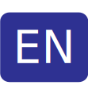
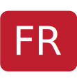
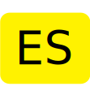

# Distintivos

Distintivos são pequenos indicadores para te informar mais sobre um YouTuber específico. 0 ou mais distintivos podem ser concedidos à um YouTuber. Estes distintivos apenas servem como informações adicionais para você enquanto navega através desta lista.

 

#### Canal do YouTube verificado

Este distintivo é concedido aos YouTubers que tem um símbolo de verificado nos seus canais. Aprenda mais sobre canais do YouTube verificados [aqui](https://support.google.com/youtube/answer/3046484?hl=en).

 

#### Post de videos semanais

Este distintivo é concedido a YouTubers que postam pelo menos 1 vídeo por semana.

 

#### YouTubers falantes de Português Brasileiro

Este distintivo é concedido a YouTubers que fazem seus conteúdos em Português Brasileiro.

 

#### YouTubers falantes de Inglês

Este distintivo é concedido a YouTubers que fazem seus conteúdos em Inglês.

 

#### YouTubers falantes de Francês

Este distintivo é concedido a YouTubers que fazem seus conteúdos em Francês.

 

#### YouTubers falantes de Espanhol

Este distintivo é concedido a YouTubers que fazem seus conteúdos em Espanhol.
